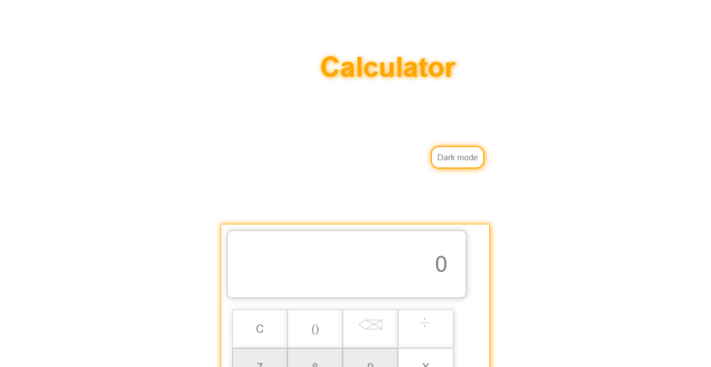

# Calculator

## Description

This is my attempt on building the front-end of the assigned 'Calculator' project.

My knowledge on HTML, CSS and JavaScript and how to use them together for building the front-end of a web page are being tested. 

I am using HTML5 and CSS3 for this project.

## Preview of my web page

## How to use the calculator

1. Click on the buttons with your mouse to do any arithmetic operation.

2. Press the keys on your keyboard to do an arithmetic operation.

## Use the Calculator

## Author

Losalini Rokocakau **GitHub username:** *chelmerrox*

